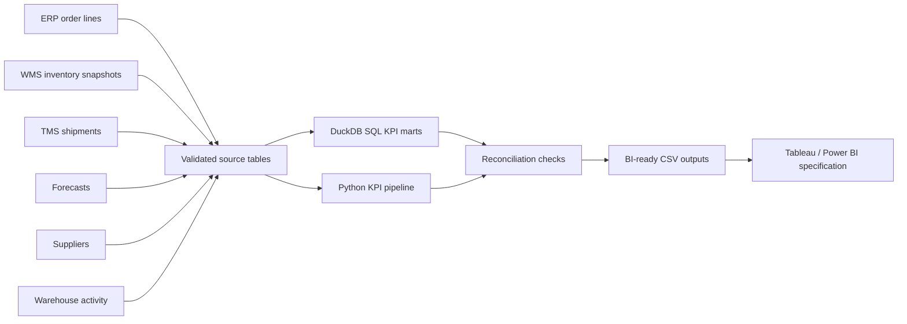

# Supply Chain Operations Control Tower

A reproducible portfolio lab that integrates ERP-style order lines, WMS-style inventory snapshots, TMS-style shipments, forecasts, suppliers and warehouse activity into a BI-ready operations control tower.

The project is a **local simulation** designed to demonstrate supply chain analytics, advanced SQL, Python automation, data quality, dimensional thinking and stakeholder communication. It does not claim production deployment or confidential enterprise data.

## Business problem

Operations leaders need one governed view of service, inventory, freight and resilience. This lab answers:

- Are orders delivered **on time and in full (OTIF)**?
- Are customers receiving the units they ordered (**unit fill rate**)?
- Which carriers, warehouses, suppliers, products and customers drive exceptions?
- Where are stockouts, backorders and long lead times concentrated?
- How much does freight cost per shipment and per kilogram?
- Where does forecast error create inventory or service risk?

## Architecture



## KPI definitions that matter

- **Unit Fill Rate:** shipped units / ordered units.
- **Complete Order Rate:** orders with every ordered unit shipped / total orders.
- **On-Time Delivery:** orders delivered by the promised date / delivered orders.
- **OTIF:** orders delivered by the promised date **and** fully shipped / total orders.

These measures are intentionally separated. A complete-order rate is not labeled as fill rate.

## Repository structure

```text
├── data/
│   ├── generate_synthetic_data.py
│   └── generated/
├── sql/
│   └── supply_chain_kpis.sql
├── python/
│   └── calculate_kpis.py
├── validation/
│   └── validate_outputs.py
├── tests/
│   └── test_kpis.py
├── outputs/
├── kpis/
│   └── kpi_dictionary.md
├── docs/
│   ├── data_model.md
│   └── ai_augmented_workflow.md
├── stakeholder_summary/
│   └── executive_summary.md
└── tableau_spec/
    └── control_tower_dashboard.md
```

## Quick start

```bash
python -m venv .venv
source .venv/bin/activate        # Windows: .venv\\Scripts\\activate
pip install -r requirements.txt
python data/generate_synthetic_data.py
python python/calculate_kpis.py
python validation/validate_outputs.py
pytest -q
```

The pipeline writes:

- `outputs/kpi_summary.csv`
- `outputs/carrier_scorecard.csv`
- `outputs/customer_cost_to_serve.csv`
- `outputs/stockout_exceptions.csv`
- `outputs/supplier_risk_scorecard.csv`
- `outputs/data_quality_report.csv`

## Skills demonstrated

- advanced SQL with layered CTEs, windows, ranking, rolling metrics and reconciliation;
- Python/pandas pipeline design and CLI execution;
- ERP/WMS/TMS-style analytical modeling;
- supply chain KPI governance;
- deterministic synthetic data generation;
- data quality validation and automated tests;
- BI-ready output design and stakeholder storytelling;
- human-validated AI-assisted analytics workflow.

## Validation approach

1. Source schemas and key uniqueness are checked.
2. KPI values are constrained to valid ranges.
3. Python metrics are reconciled to independently calculated expectations.
4. OTIF and fill rate are tested as different measures.
5. Output files must be non-empty and use documented grains.

## Limitations

- Data is synthetic and does not represent a real employer or client.
- Freight, handling and resilience formulas are simplified for portfolio use.
- Forecast accuracy uses weighted absolute percentage error because MAPE is unstable when actual demand is zero.
- The warehouse implementation is local; cloud folders in the wider portfolio show platform-specific patterns.
