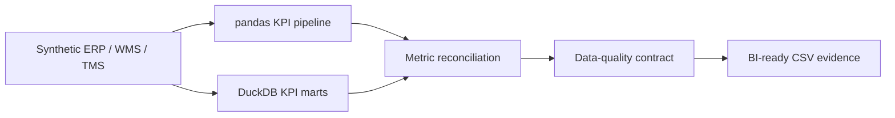

# Supply Chain Operations Control Tower

[](https://github.com/net421/supply-chain-operations-control-tower/actions/workflows/quality.yml)

A reproducible local analytics project that integrates synthetic ERP order lines,
TMS shipments, WMS inventory, forecasts, suppliers and warehouse activity. It
demonstrates the technical work behind a supply-chain dashboard: governed KPIs,
independent Python and SQL implementations, reconciliation, exception outputs,
data-quality controls and automated tests.

This repository does **not** claim production deployment, enterprise platform
experience, real users or confidential business data.

## Evidence in 60 seconds

| Question a reviewer may ask | Direct evidence |
|---|---|
| Can the analysis answer a manager's question? | Start with the [manager case study](docs/manager_case_study.md), tracked in [Issue #5](https://github.com/net421/supply-chain-operations-control-tower/issues/5): request, evidence, findings, bounded decisions and limitations. |
| Can I trace a change from problem to checked output? | The case study maps [Issue #3](https://github.com/net421/supply-chain-operations-control-tower/issues/3) to [PR #4](https://github.com/net421/supply-chain-operations-control-tower/pull/4), 11 current tests, eight reconciled metrics and 38 data contracts. |
| Can the project run from a clean checkout? | [`run_pipeline.py`](run_pipeline.py) executes generation, KPIs, SQL reconciliation, validation and optional tests. |
| Is the SQL executed or only displayed? | [`supply_chain_kpis.sql`](sql/supply_chain_kpis.sql) creates DuckDB marts that run in CI. |
| Do two implementations agree? | [`sql_python_reconciliation.csv`](outputs/sql_python_reconciliation.csv) compares eight SQL and pandas metrics. |
| Are source and output assumptions checked? | [`data_quality_report.csv`](outputs/data_quality_report.csv) records 38 source, grain, date, KPI and output checks. |
| Are KPI definitions governed? | [`kpi_dictionary.md`](kpis/kpi_dictionary.md) separates fill rate, complete-order rate, OTD and OTIF. |
| Can the analysis support an operating review? | [`executive_summary.md`](stakeholder_summary/executive_summary.md) turns generated outputs into bounded observations and questions. |
| Are limitations explicit? | [Validation contract](docs/control_tower_validation.md) documents assumptions, a corrected generator defect and unsupported claims. |

## Current reproducible snapshot

The deterministic seed currently produces 2,400 orders and 5,928 order lines:

| KPI | Result |
|---|---:|
| Unit fill rate | 96.79% |
| Complete-order rate | 85.75% |
| On-time delivery | 70.83% |
| OTIF | 60.62% |
| Backorder rate | 3.21% |
| Weighted forecast accuracy | 82.90% |
| Stockout location-SKU rate | 9.50% |
| Total modeled cost-to-serve | 972,618.91 |

The stockout denominator excludes zero-demand snapshots: 302 of 3,179
positive-demand location-SKU combinations have zero on-hand inventory.

The gap between fill rate and OTIF is intentional: units can be mostly fulfilled
while whole orders still arrive late or incomplete.

The [manager case study](docs/manager_case_study.md) decomposes the 2,400 orders
into a four-part service review queue and shows which decisions the evidence can
and cannot support.

## Architecture



The SQL layer materializes four reusable views:

- `mart_order_service`: one row per order;
- `mart_kpi_summary`: governed headline metrics;
- `mart_carrier_scorecard`: carrier service and cost rankings;
- `mart_daily_service`: calendar-based rolling 30-day performance, weighted by
  orders for OTD/OTIF and by units for fill rate.

## Quick start

```bash
python -m venv .venv
source .venv/bin/activate        # Windows: .venv\Scripts\activate
pip install -r requirements.txt
python run_pipeline.py --with-tests
```

The command exits non-zero if generation, KPI calculation, SQL execution,
reconciliation, validation or tests fail.

## Main outputs

- [`kpi_summary.csv`](outputs/kpi_summary.csv)
- [`order_service_detail.csv`](outputs/order_service_detail.csv)
- [`carrier_scorecard.csv`](outputs/carrier_scorecard.csv)
- [`customer_cost_to_serve.csv`](outputs/customer_cost_to_serve.csv)
- [`stockout_exceptions.csv`](outputs/stockout_exceptions.csv)
- [`supplier_risk_scorecard.csv`](outputs/supplier_risk_scorecard.csv)
- [`data_quality_report.csv`](outputs/data_quality_report.csv)
- [`sql_python_reconciliation.csv`](outputs/sql_python_reconciliation.csv)

## What this demonstrates

- supply-chain KPI reasoning across service, inventory, freight and planning;
- order-line to order-grain aggregation and dimensional thinking;
- pandas automation and DuckDB SQL with CTEs, windows, ranking and marts;
- reconciliation between independently implemented metric paths;
- referential, temporal, grain, range and business-rule validation;
- deterministic test data, regression tests and GitHub Actions;
- clear separation between observations, recommendations and limitations.

For visual dashboard evidence, this technical backend is intended to complement
the separate [logistics-dashboard](https://github.com/net421/logistics-dashboard)
Streamlit/Plotly project. The file in [`tableau_spec/`](tableau_spec/control_tower_dashboard.md)
is a BI specification only; it is not presented as a Tableau or Power BI workbook.

## Limitations

- All data is deterministic and synthetic; results are portfolio evidence, not
  measured business impact.
- The model assumes one shipment per order and does not support split shipments.
- Freight, handling, forecast and resilience formulas are simplified.
- Forecast accuracy is `1.0` when forecast and actual are both zero, `0.0` when
  actual demand is zero but forecast error exists, and otherwise uses bounded
  weighted absolute error.
- Supplier risk attributes an order's backorders to every supplier represented in
  that order, so it is a prioritization signal rather than causal attribution.
- The warehouse is local DuckDB, not PostgreSQL, cloud or a production service.
- No scheduled refresh, SLA, external user or operational incident is claimed.

See [`docs/control_tower_validation.md`](docs/control_tower_validation.md) for the
validation contract and [`docs/ai_augmented_workflow.md`](docs/ai_augmented_workflow.md)
for the human-reviewed AI-assisted development policy.
