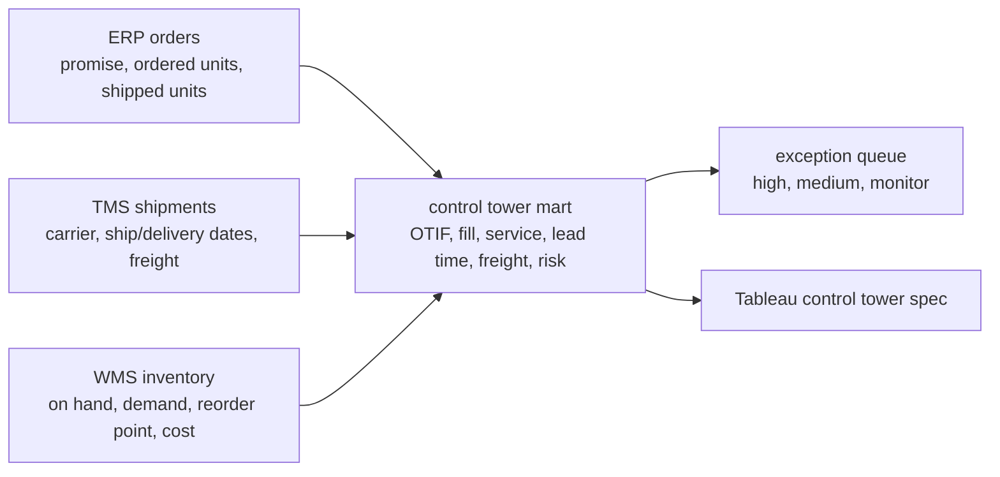

# Control Tower Validation Artifact

This artifact turns synthetic ERP, TMS, and WMS samples into a reviewable supply chain control tower. It is a lab pattern for portfolio evidence, not a production deployment claim.

## Business Scenario

Operations leaders need a daily view of which orders are late, partially filled, backordered, at stockout risk, or creating freight-cost pressure. The artifact keeps KPI definitions, data lineage, exception logic, and validation checks visible.

## Lineage



## Validation Contract

The SQL validation queries and Python validator check:

- ERP order grain is unique by `order_id`.
- TMS shipments reference valid ERP orders.
- Any order with shipped units has a shipment record.
- Units shipped are non-negative and do not exceed units ordered.
- Promised dates do not precede order dates.
- Delivery dates do not precede ship dates.
- TMS `on_time` flag agrees with delivery date versus promised date.
- WMS inventory values are non-negative and average inventory value is positive.

## Exception Logic

| Priority | Rule | Operations Meaning |
| --- | --- | --- |
| High | Zero units shipped, or partial fill overlaps stockout/reorder risk. | Immediate service recovery or allocation review. |
| Medium | Partial fill or late delivery. | Triage with customer service, warehouse, or carrier. |
| Monitor | Inventory below reorder point without current service failure. | Watch replenishment before it becomes a service issue. |
| Normal | No active exception. | Standard dashboard monitoring. |

## Local Review

Run:

```bash
python python/calculate_kpis.py
```

Expected behavior:

- Load the synthetic ERP, TMS, and WMS samples.
- Run input validation checks.
- Build order-level control tower rows.
- Print a summary, carrier scorecard, validation check count, and exception queue.

## Assumptions And Limits

- The samples are synthetic and intentionally small enough for human review.
- An order is OTIF only when it is both on time and in full.
- Service level is less strict than OTIF and only checks promised-date performance.
- Inventory turnover uses synthetic trailing 90-day COGS and average inventory value.
- Freight cost is attributed at the shipment/order level, not allocated to SKU lines.
- Forecast accuracy and warehouse productivity are named in the broader KPI dictionary but not modeled in this specific artifact because the sample data does not include forecasts or labor hours.
