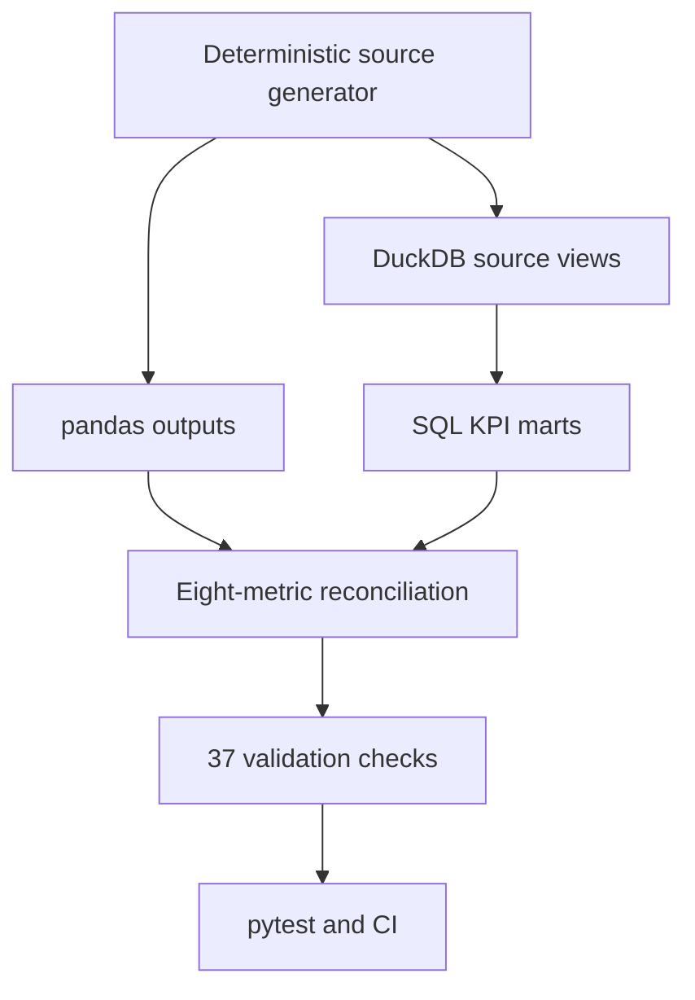

# Control Tower Validation Contract

This document describes what the current repository actually executes. The
project is a deterministic local simulation, not a production control tower.

## Executed lineage



`run_pipeline.py` executes this lineage in dependency order and stops on the
first failure. GitHub Actions runs the same command with `--with-tests`.

## Grains and keys

| Dataset or mart | Grain | Enforced key or rule |
|---|---|---|
| `erp_order_lines` | one row per order line | unique `order_line_id` |
| `tms_shipments` | one shipment per order | unique `order_id` in this simplified model |
| `wms_inventory_snapshots` | one snapshot/SKU/warehouse | composite uniqueness |
| `demand_forecasts` | one month/SKU/warehouse | composite uniqueness |
| `warehouse_activity` | one month/warehouse | composite uniqueness |
| `mart_order_service` | one row per order | duplicate orders fail reconciliation |
| `mart_kpi_summary` | one row for the modeled portfolio | eight metrics reconcile to pandas |

The ERP source is deliberately line-grain. Any claim that it is unique by
`order_id` is incorrect; aggregation happens before service classification.

## Validation layers

| Layer | Examples | Evidence |
|---|---|---|
| Referential integrity | shipment orders, customers, products and suppliers exist | `outputs/data_quality_report.csv` |
| Temporal logic | promise >= order, ERP/TMS promises agree, delivery >= ship, source on-time flag agrees with dates | `outputs/data_quality_report.csv` |
| Numeric contracts | non-negative units, inventory and forecasts; positive labor hours | `outputs/data_quality_report.csv` |
| Output grains | unique order detail and unique summary metrics | `outputs/data_quality_report.csv` |
| KPI invariants | service, forecast and stockout rates stay in `[0, 1]`; OTIF <= components; fill + backorder = 1 | `outputs/data_quality_report.csv` |
| Independent calculation | normalized pandas and DuckDB values agree within `1e-9` | `outputs/sql_python_reconciliation.csv` |
| Regression behavior | multi-line aggregation, natural rolling weights, zero-demand forecast policy, stable reconciliation bytes and mismatch detection | `tests/` |

Validation failures raise a non-zero process exit; they are not converted into
warnings or silently discarded.

## Aggregation and zero-demand policies

Rolling 30-day OTD and OTIF accumulate qualifying orders divided by total orders.
Rolling fill rate accumulates shipped units divided by ordered units. The mart
does not average daily percentages because that would give a low-volume day the
same influence as a high-volume day.

Weighted forecast accuracy follows an explicit zero-demand rule:

- forecast and actual both total zero: `1.0`;
- actual totals zero but any absolute forecast error exists: `0.0`;
- otherwise: `max(0, 1 - sum(abs(forecast - actual)) / sum(actual))`.

Before the reconciliation CSV is written, rates are normalized to 12 decimal
places, order counts to whole values and modeled money to two decimals. The
comparison still uses the documented tolerance, and a regression test writes the
report twice and asserts byte-identical output.

## Corrected defect: impossible delivery chronology

While strengthening the temporal contract, the generated data failed
`delivery_not_before_ship`. The generator independently sampled ship offsets and
delivery offsets from the promised date. For short service promises, this could
produce a delivery date earlier than the ship date.

The repair in `data/generate_synthetic_data.py` now:

1. calculates the candidate delivery date;
2. clamps delivery to the later of candidate delivery and ship date;
3. recalculates effective delay from the corrected delivery date;
4. derives exception cost and the on-time flag from that chronology;
5. enforces the rule in every pipeline and CI run.

This is a real repository defect found and repaired during validation. It is not
presented as a production incident or client outage.

## Local verification

```bash
python run_pipeline.py --with-tests
```

Expected outputs include:

- eight `PASS` rows in `outputs/sql_python_reconciliation.csv`;
- 37 `PASS` rows in `outputs/data_quality_report.csv`;
- all pytest cases passing;
- a final `Control tower pipeline completed successfully.` message.

## Modeling limits

- Data is synthetic and covers a single deterministic scenario.
- One shipment per order avoids split-shipment allocation complexity.
- OTD and OTIF use all modeled orders because every modeled order has a shipment
  and delivery; a production denominator would need explicit cancellation and
  open-order policy.
- Supplier risk may attribute an order-level backorder to multiple suppliers when
  an order contains products from multiple suppliers.
- The SQL and pandas paths share the same generated sources, so reconciliation
  detects calculation drift but not source-system truth.
- The Tableau document is a specification, not an executed workbook.
