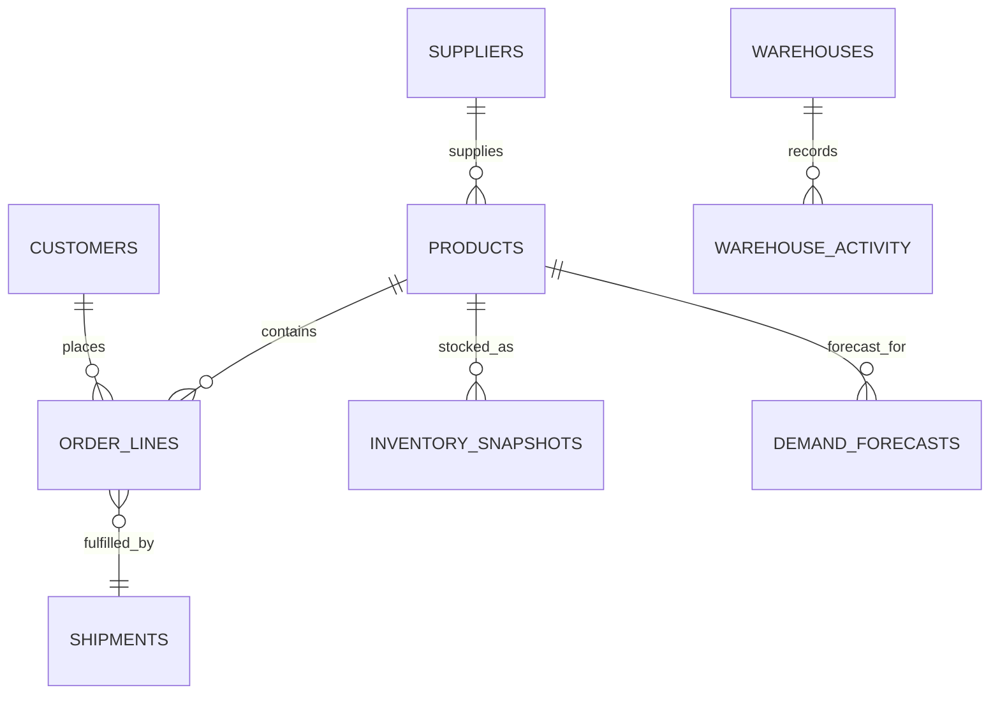

# Data Model and Grain

## Tables

| Table | Grain | Primary key |
|---|---|---|
| `customers` | one row per customer | `customer_id` |
| `suppliers` | one row per supplier | `supplier_id` |
| `products` | one row per SKU | `sku` |
| `erp_order_lines` | one row per order line | `order_line_id` |
| `tms_shipments` | one row per order/shipment | `shipment_id`, unique `order_id` |
| `wms_inventory_snapshots` | one SKU/warehouse/month | composite |
| `demand_forecasts` | one SKU/warehouse/month | composite |
| `warehouse_activity` | one warehouse/month | composite |
| `mart_order_service` | one row per order | `order_id` |

The portfolio uses one shipment per order to keep reconciliation inspectable. A production model would usually support split shipments through a bridge between order lines, fulfillment lines and shipment events.
